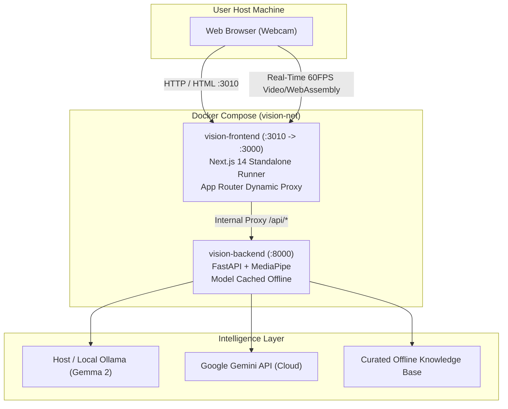

# MediaPipe Vision Lens & LLM Reasoning Assistant (Dockerized Next.js Edition)

> **Traceability**: Tracked under Jira Epic `KAN-49` (Tasks: `KAN-50`, `KAN-51`, `KAN-52`, `KAN-53`, `KAN-54`, `KAN-55`, `KAN-56`).

A cutting-edge real-time computer vision application that tracks whatever is in front of the camera using **MediaPipe**, identifies objects, and uses an **LLM** (e.g. Gemma 3.2B / 2B, Ollama, Google Gemini, or offline fast engine) to provide rich encyclopedic knowledge, technical specifications, safety tips, and interactive Q&A.

**Frontend:** Built with **Next.js 14 (App Router)**, **React 18**, **Tailwind CSS**, and **Lucide React**.  
**Backend:** Built with **FastAPI**, **MediaPipe Python**, and multi-provider LLM integration.  
**Deployment:** Fully dockerized with **Docker Compose** (multi-stage production builds and automatic healthchecks).

---

## 🌟 Architecture & Container Layout



---

## 🚀 One-Command Launch (Docker)

Start the entire application in the background:

```powershell
docker compose up -d
```

### Accessing the App:
- **Frontend UI**: Open your browser at **[http://localhost:3010](http://localhost:3010)**
- **Backend API Docs**: Swagger UI at **[http://localhost:8000/docs](http://localhost:8000/docs)**

To view real-time logs:
```powershell
docker compose logs -f
```

To stop all services:
```powershell
docker compose down
```

---

## 🛠️ Project Structure

```
vision_app/
├── docker-compose.yml         # Multi-container orchestration (Frontend + Backend)
├── .dockerignore              # Root Docker ignore rules
│
├── backend/
│   ├── Dockerfile             # Python 3.12-slim container with MediaPipe & cached model
│   ├── config.py              # Application settings & environment variables
│   ├── detector.py            # MediaPipe Python ObjectDetector wrapper
│   ├── llm_service.py         # Multi-provider LLM adapter (Ollama, Gemini, Offline)
│   ├── main.py                # FastAPI entrypoint & REST API
│   ├── schemas.py             # Pydantic models for request/response validation
│   └── models/
│       ├── download_models.py # Model downloader for EfficientDet-Lite0
│       └── efficientdet_lite0.tflite
│
├── frontend/                  # Next.js 14 Application
│   ├── Dockerfile             # Multi-stage production container with standalone runner
│   ├── .dockerignore          # Frontend Docker ignore rules
│   ├── app/
│   │   ├── layout.tsx         # Root layout with dark mode
│   │   ├── page.tsx           # Main page orchestrating Viewfinder & Insights
│   │   ├── globals.css        # Tailwind & Cyberpunk scanline styles
│   │   └── api/[...path]/route.ts # Runtime dynamic reverse-proxy to FastAPI backend
│   ├── components/
│   │   ├── Header.tsx         # Telemetry bar, engine/GPU status & provider selector
│   │   ├── CameraViewfinder.tsx # MediaPipe camera tracking & canvas HUD
│   │   └── InsightsPanel.tsx  # Deep encyclopedic view & follow-up chat
│   ├── lib/
│   │   ├── hud.ts             # 60fps canvas reticle and box drawing
│   │   ├── speech.ts          # Web Speech API text-to-speech helper
│   │   └── types.ts           # Shared TypeScript interfaces
│   ├── next.config.mjs        # Next.js configuration (output: standalone)
│   └── package.json           # Next.js dependencies
│
├── frontend_static/           # Preserved standalone static HTML fallback
├── tests/
│   └── test_app.py            # Automated pytest suite
├── requirements.txt           # Python backend dependencies
└── .env.example               # Environment variables template
```

---

## 🧪 Verification & Local Development with UV

We strictly use **[uv](https://github.com/astral-sh/uv)** for high-performance Python package and virtual environment management:

```powershell
# Create virtual environment with uv
uv venv

# Install dependencies into uv environment
uv pip install -r requirements.txt

# Run backend pytest suite with uv
uv run pytest tests/test_app.py -v

# Start FastAPI backend directly with uv
uv run uvicorn backend.main:app --host 0.0.0.0 --port 8000 --reload
```
