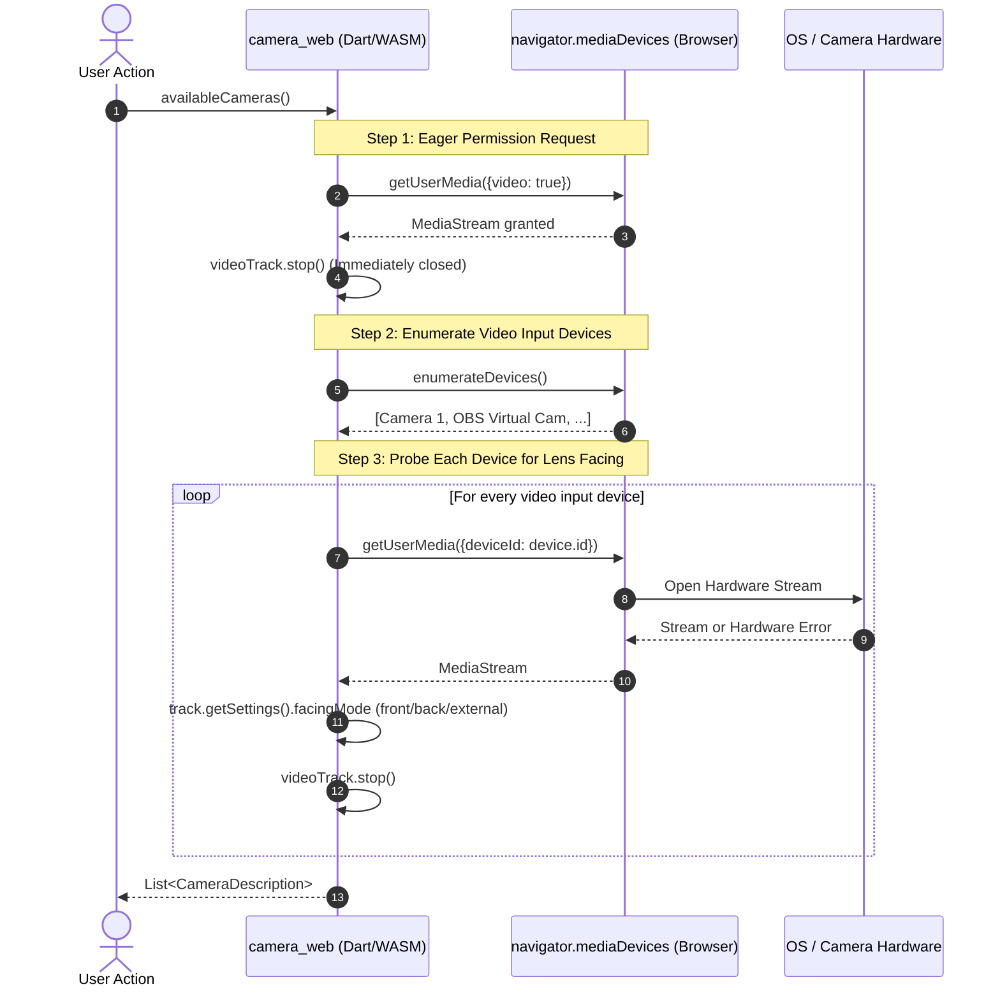

# Troubleshooting Guide: Flutter Web Camera Integration (`camera_web`)

This document provides an in-depth architectural breakdown, root cause analysis, diagnostic matrix, and proven solutions for camera discovery and hardware access issues encountered when building and deploying Flutter Web applications.

---

## 1. How Camera Discovery Works in Flutter Web

On mobile platforms (Android Camera2, iOS AVFoundation), camera enumeration is performed directly via the OS kernel without opening an active camera stream. 

In Flutter Web, camera functionality is implemented by the **`camera_web`** plugin, which delegates directly to the browser's **W3C Media Capture and Streams API** (`navigator.mediaDevices`).



### Why Step 1 (Eager Permission) Exists
Modern browsers enforce **device fingerprinting mitigation**:
- Prior to the user granting camera permissions to the origin, `navigator.mediaDevices.enumerateDevices()` returns `MediaDeviceInfo` objects with **empty string labels** and **empty `deviceId`s**.
- To work around this, `camera_web` must initiate an initial `getUserMedia({video: true})` call to trigger the browser's permission prompt and unlock real hardware labels and device identifiers.

---

## 2. In-Depth Root Causes of Common Issues

### Issue A: `CameraException(cameraNotReadable, ...)` / `NotReadableError`
* **Upstream Bug Reference**: [flutter/flutter#97016](https://github.com/flutter/flutter/issues/97016), [flutter/flutter#109453](https://github.com/flutter/flutter/issues/109453)
* **Root Cause**:
  In Step 3 of the enumeration sequence, `camera_web` iterates through all video input devices and opens an active stream on each one to inspect `track.getSettings().facingMode`.
* **The Failure Scenario**:
  If a user has an inactive virtual camera installed (e.g., **OBS Virtual Camera**, Elgato Cam Link, Snap Camera, ManyCam) or a physical webcam currently locked by another application (e.g., Zoom, Microsoft Teams, Discord), `getUserMedia({deviceId: device.id})` throws a DOM `NotReadableError`.
* **The Architectural Flaw**:
  In standard upstream `camera_web`, this loop does not catch errors per device. If **a single device** fails to open, `availableCameras()` aborts completely, throwing `CameraException(cameraNotReadable)` and rendering **all functional physical webcams inaccessible**.

---

### Issue B: Violation of Transient User Activation (Eager Initialization on Boot)
* **Root Cause**:
  Modern desktop and mobile browsers enforce strict **User Activation** policies for sensitive media devices.
* **The Failure Scenario**:
  If `availableCameras()` is called inside `main()` or in a root widget's `initState()` on application startup:
  1. The browser flags the unprompted `getUserMedia` call as an unwanted autoplay/security violation.
  2. Automated or headless browser environments (Puppeteer, Selenium, Chrome DevTools MCP) lack interactive permission delegates and reject the unprompted call with `NotReadableError` or hang indefinitely.

---

### Issue C: Insecure Contexts (`navigator.mediaDevices` is `undefined`)
* **Root Cause**:
  WebRTC and Media Capture APIs are restricted strictly to **Secure Contexts** (`HTTPS` or `localhost`).
* **The Failure Scenario**:
  Accessing a Flutter Web build over a plain HTTP local network IP (e.g., `http://192.168.1.50:3020` or via an unencrypted remote domain) causes `window.navigator.mediaDevices` to evaluate to `undefined`.
* **Symptom**:
  An unhandled runtime error:
  `TypeError: Cannot read properties of undefined (reading 'getUserMedia')` or `TypeError: Cannot read properties of undefined (reading 'enumerateDevices')`.

---

### Issue D: `UnimplementedError` on `startImageStream`
* **Root Cause**:
  On Android and iOS, `CameraController.startImageStream((CameraImage image) => ...)` provides continuous raw pixel buffers (YUV420, BGRA8888) for computer vision and ML processing.
* **The Limitation**:
  **`startImageStream` is NOT implemented in `camera_web`**. Calling it on Flutter Web throws `UnimplementedError`.
* **Solution**:
  Real-time web frame processing requires either:
  1. Periodic `controller.takePicture()` captures (higher latency, artificial shutter delay).
  2. Direct browser DOM interop: accessing the underlying `<video>` element created by Flutter and drawing its frames onto an offscreen HTML `<canvas>` via Dart JS Interop (`package:web`).

---

### Issue E: Webcam LED Flickering & Device Contention ([flutter/flutter#145541](https://github.com/flutter/flutter/issues/145541))
* **Root Cause**:
  Because `availableCameras()` opens and closes a media stream for every device to inspect orientation metadata, and then `CameraController.initialize()` opens the chosen camera stream a second time:
  1. The physical camera indicator light flickers on and off rapidly during startup.
  2. If the OS hardware driver takes several hundred milliseconds to release the hardware lock after the probe stream is stopped, `controller.initialize()` may immediately fail with `cameraNotReadable` due to driver contention.

---

### Issue F: WASM / `package:web` Migration Quirks
* **Root Cause**:
  In Flutter 3.22+, `camera_web` transitioned from deprecated `dart:html` to `dart:js_interop` and `package:web` to support WebAssembly (Wasm).
* **The Failure Scenario**:
  Certain browsers (such as specific Firefox releases or non-standard web views) return capability objects that differ slightly from the W3C IDL specification for `facingMode`. Older versions of `camera_web` crashed during enumeration with a JavaScript `TypeError`.

---

## 3. Diagnostic & Troubleshooting Matrix

| Symptom | Probable Cause | Recommended Fix |
| :--- | :--- | :--- |
| `CameraException: cameraNotReadable` | Inactive virtual camera (OBS), locked device, or eager probe failure. | Apply resilient `camera_web` patch with per-device `try-catch`; close background apps using the camera. |
| Camera hangs on loading spinner on page boot | `availableCameras()` called eagerly on startup without user gesture. | Defer camera discovery to an explicit user interaction (e.g., "Start Camera" button). |
| `TypeError: Cannot read properties of undefined` | Served over insecure `http://` on non-localhost IP. | Serve over **HTTPS** (or `http://localhost`). Ensure `allow="camera; microphone"` if embedded in an `<iframe>`. |
| `UnimplementedError: startImageStream` | Attempting to stream raw frames via mobile API on Web. | Use `<canvas>` / `<video>` DOM interop via `package:web` or periodic image captures. |
| Green camera LED flickers multiple times | Redundant media stream probes during device enumeration. | Defer enumeration; use cached camera descriptions where possible. |
| Permission denied without prompt appearing | User previously blocked camera permissions for the origin. | Reset camera permissions in the browser address bar (site settings lock icon). |

---

## 4. Solutions Implemented in `vision_app`

### 1. Resilient `camera_web` Patch (`flutter_frontend/packages/camera_web`)
We patched the local `camera_web` dependency override (`flutter_frontend/pubspec.yaml`) in `lib/src/camera_web.dart`:

```dart
// Safely probe each device without aborting enumeration on failure:
Object? firstDeviceError;
for (final videoInputDevice in videoInputDevices) {
  final web.MediaStream videoStream;
  try {
    videoStream = await _getVideoStreamForDevice(videoInputDevice.deviceId);
  } catch (e) {
    // Skip unopenable or virtual devices (e.g. OBS Virtual Camera)
    firstDeviceError ??= e;
    continue;
  }
  // Extract facingMode and register valid camera...
}
```

### 2. Deferred User-Gesture Initialization
In [`flutter_frontend/lib/state/vision_provider.dart`](file:///C:/Users/abhi3/Documents/work/vision_app/flutter_frontend/lib/state/vision_provider.dart), eager camera calls were removed from `initialize()`. 

The app boots immediately into an interactive standby state. Camera permissions and hardware enumeration are triggered strictly when the user clicks the **Start Camera** button.

### 3. Virtual Demo Stream Fallback
In [`flutter_frontend/lib/widgets/camera_view.dart`](file:///C:/Users/abhi3/Documents/work/vision_app/flutter_frontend/lib/widgets/camera_view.dart), a **Virtual Demo Stream** option provides synthetic detection frames. This guarantees full end-to-end functionality in automated CI/CD pipelines, headless testing environments, and systems without physical webcams.
